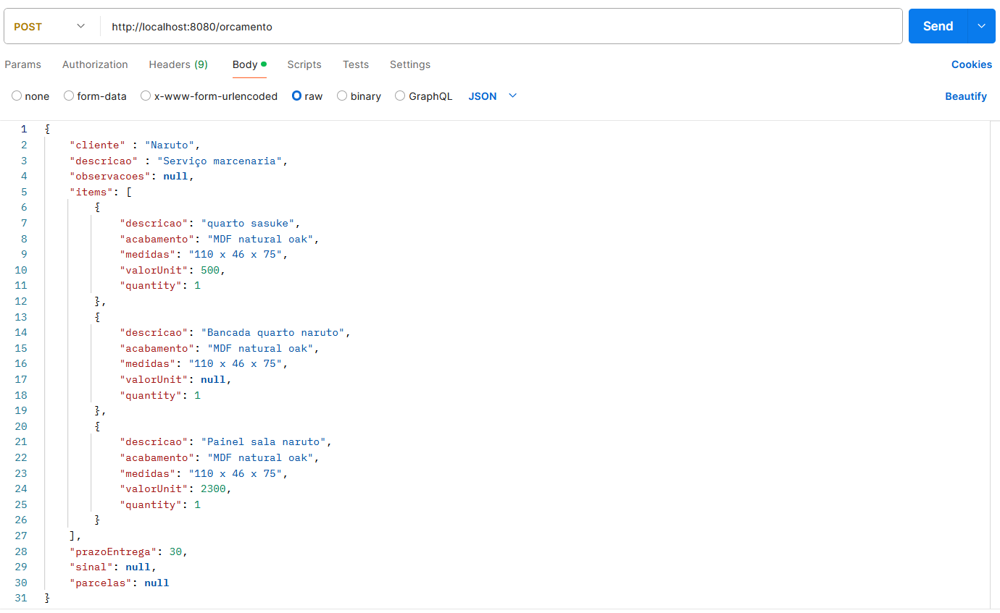
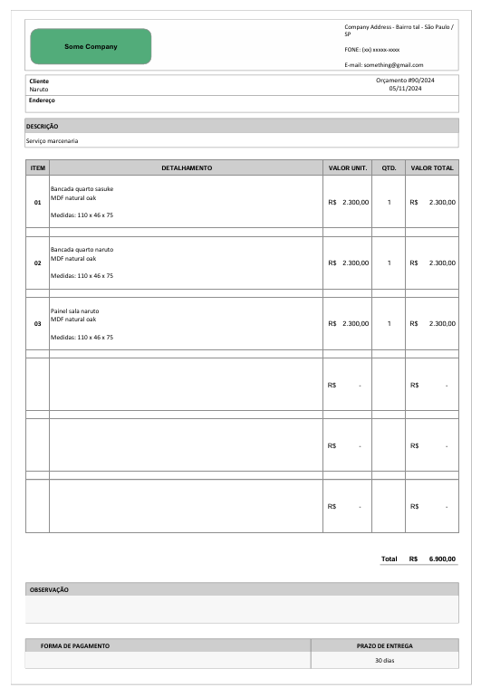
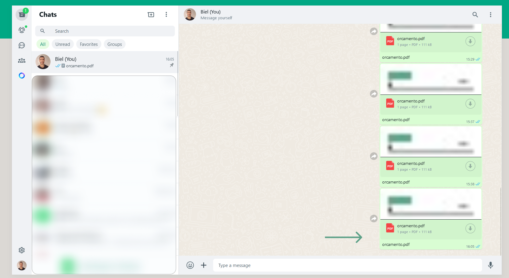
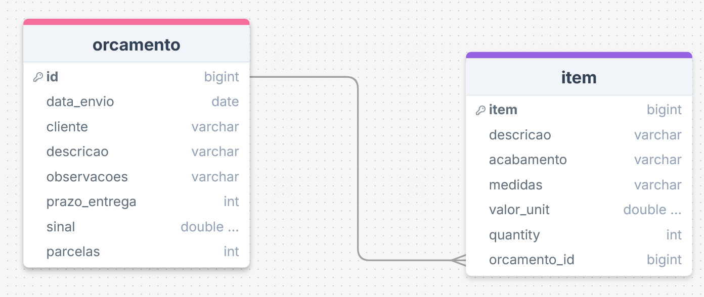
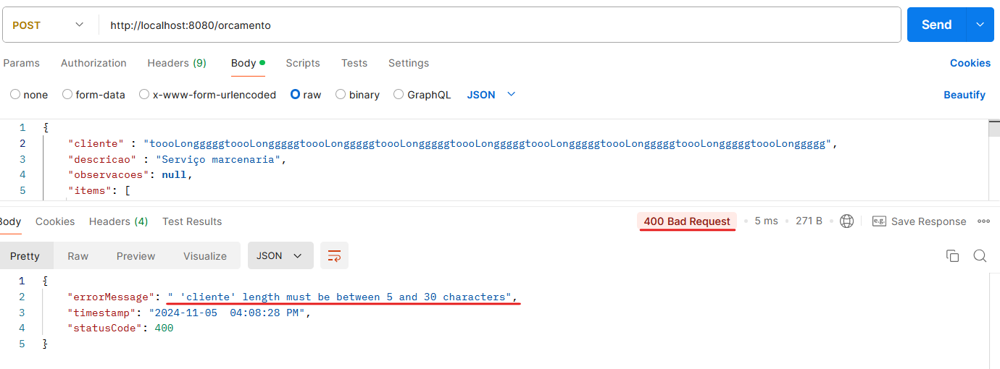
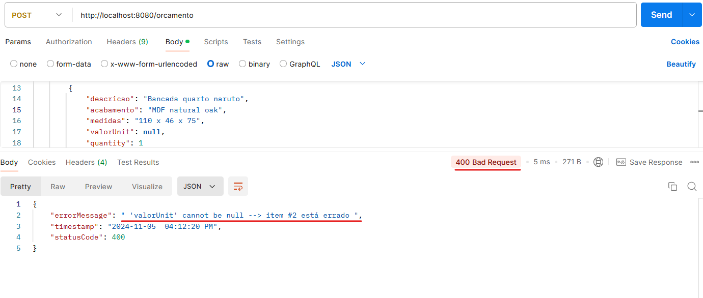
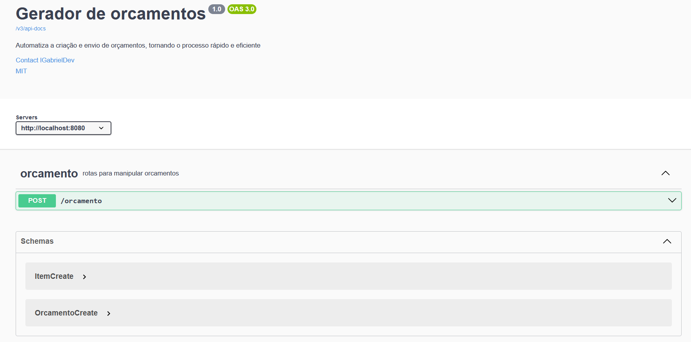
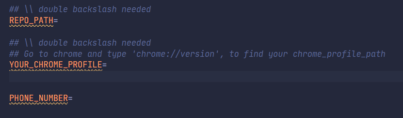

<!-- title -->
<h1 align="center">
    <span>Gerador de orçamentos</span>
</h1>

<br>

<!-- badges -->
<div align="left">
    </img>
    </img>
    </img>
</div>

<br>

<!-- About -->
##  Sobre o Projeto

Essa aplicação automatiza a criação e envio de orçamentos, tornando o processo rápido e eficiente. 
Funciona assim:

<br>

- Através de uma rota POST, é feita uma requisição com os dados necessários para o orçamento.

    

<br>

- Depois de validado os dados, é criado um arquivo Excel (.xlsm) detalhado, com base em um modelo já existente.

    


- A partir desse arquivo Excel, é gerado um PDF pronto para envio.

<br>

- Esse PDF é enviado diretamente para o WhatsApp da pessoa desejada.

    

<hr>
<br>

<!-- Technologies e dependencias -->
##  Tecnologias e dependencias
- Java 17
- Spring Boot 3.3.5
- Spring Web
- Apache POI --> Usado para manipular arquivos xlsx (orcamentos)
- selenium --> Dependencia que simula o navegador. Assim, conseguimos enviar o pdf para o whatsapp.
- OpenAPI (Swagger)


<hr>
<br>

<!-- Diagram -->
###  Diagrama de relacionamento

A aplicação trabalha com 2 entidades:

- Orcamento
- Item

<br>




<hr>
<br>

<!-- Validations -->
##  Validações


*Exempo do Objeto JSON enviado na requisicao*
```json
{
    "cliente" : "Naruto",
    "descricao" : "Serviço marcenaria",
    "observacoes": null,
    "items": [
        {
            "descricao": "quarto sasuke",
            "acabamento": "MDF natural oak",
            "medidas": "110 x 46 x 75",
            "valorUnit": 500,
            "quantity": 1
        },
        {
            "descricao": "Bancada quarto naruto",
            "acabamento": "MDF natural oak",
            "medidas": "110 x 46 x 75",
            "valorUnit": 55,
            "quantity": 1
        },
        {
            "descricao": "Painel sala naruto",
            "acabamento": "MDF natural oak",
            "medidas": "110 x 46 x 75",
            "valorUnit": 2300,
            "quantity": 1
        }
    ],
    "prazoEntrega": 30,
    "sinal": null,
    "parcelas": null
}
```


Esses campos seguem as seguintes validacoes:


### orcamento
- **cliente**
    - Não pode ser null
    - Deve possuir entre 5 e 30 characters

- **descricao**
    - Não pode ser null
    - Deve possuir entre 5 e 45 characters

- **observacoes**
    - Deve possuir entre 5 e 200 characters

- **descricao**
    - Não pode ser null
    - Deve possuir entre 5 e 45 characters

- **prazoEntrega**
    - Deve ser maior que 0

- **sinal**
    - Deve ser maior que R$ 1.000,00
    - Se preenchido, o campo 'parcelas' deve ser preenchido também

- **parcelas**
    - Deve ser maior que 1
    - Se preenchido, o campo 'sinal' deve ser preenchido também

<br>

### item

- **descricao**
    - Não pode ser null
    - Deve possuir entre 5 e 80 characters

- **acabamento**
    - Não pode ser null
    - Deve possuir entre 5 e 80 characters

- **medidas**
    - Deve possuir entre 5 e 80 characters

- **valorUnit**
    - Não pode ser null
    - Deve possuir ser maior que 0

- **quantity**
    - Não pode ser null
    - Deve possuir ser maior que 0

<hr>
<br>

<!-- Custom Exception Handler -->
##  Lançamento de exceções customizadas

Todas as exceções foram personalizadas para um melhor entendimento do usuário

**Exemplo 1**

	
	
<br>

**Exemplo 2**

	

<hr>
<br>

## Documentação no Swagger

	

<hr>
<br>

##  Endpoints

| Método Http | URI |  Descrição | Status Code esperado |                  
| :---:       | :--- |  :---     | :---:                |
| POST        | `http://localhost:8080/orcamento`| Criar e enviar orcamento    | 201 |

<hr>
<br>

<!-- Build and run -->
##  Rodando a aplicação

### Requisitos

- java 17

<br>

### Passo a passo

1. Clone esse repositório
    ```bash
    git clone https://github.com/lGabrielDev/gerador_orcamentos
    ```
<br>

2. Vá ao diretorio

    ```bash
    cd gerador_orcamentos
    ```

<br>

3. Atribua os valores das variáveis no aplication.properties

    

    <br>

    - **REPO_PATH** --> Local da sua máquina onde você salvou esse repositorio

    - **YOUR_CHROME_PROFILE** --> Seu perfil do navegador google chrome. Informando o perfil, você só irá precisar autenticar o WhatsApp apenas 1 vez. Para encontrar seu perfil, abra o navegador e digite `chrome:version`

    - **PHONE_NUMBER** --> Numero da pessoa que voce quer enviar o orcamento. DDD + Numero `XXxxxxx-xxxx`


<br>

4.  Rode a aplicação e crie seu orcamento:

    `http://localhost:8080/swagger.html`

<hr>
<br>


<!-- Credits -->
<h2>
    
    <span>Créditos</span>
</h2>

<p>As imagens usadas nesse projeto foram retiradas dos seguintes sites:</p>

- [shields.io](https://shields.io/)
- [iconfinder](https://www.iconfinder.com/)
- [storyset](https://storyset.com/)
- [vecteezy](https://www.vecteezy.com)
- [svgrepo](https://www.svgrepo.com)

<br>

<span>Thanks!</span>

<hr>
<br>


<!-- License -->
##  Licença --> MIT

O projeto está sob a licença do [MIT](./LICENSE).

<hr>
<br>

<!-- Author -->
##  Autor

<br>

<div align="center">
    
    <p> <a href="https://github.com/lGabrielDev">Gabriel Freitas</a> 😎 </p>
</div>